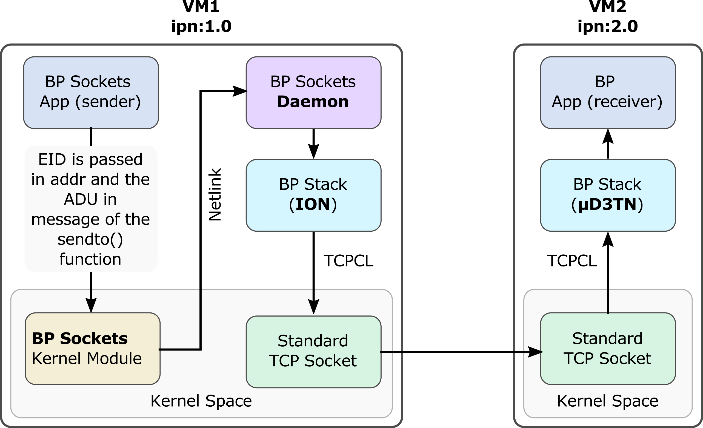

# BP Sockets

The outcome of STINT 2024 Hackathon. Authored by Scott Burleigh (APL), Felix Walter (D3TN), Olivier De Jonckere (LIRMM), Juan Fraire (Inria), Brian Sipos (APL), Samo Grasic (ICTP), Brian Tomko (NASA), and Ricardo Lent (UH).

## STINT
The Space-Terrestrial Internetworking (STINT) Workshop brings together space networking research and the industrial community's interest in Delay and Disruption-Tolerant Networking (DTN). Sponsored by IPNSIG and D3TN, the 11th edition of STINT was held at the IEEE SMC-IT/SSC conference in Mountain View, California.

## Hackathon
Day 3 of STINT 2024 (July 19th) was dedicated to a hackathon organized by Scott Burleigh. The goal was to tackle a core DTN problem: providing a clean, interoperable API to facilitate application developers in sending data using the Bundle Protocol (BP).

The hackathon focused on implementing such an API based on POSIX sockets. This approach has the central advantage that it requires only minimal modifications in existing applications: only the address family passed to the socket() system call plus the addresses themselves (that are replaced with DTN endpoint identifiers) would need to be adapted in existing applications otherwise using datagram (e.g., UDP) sockets.

### Architecture
The resulting “BP Sockets” interface integrates with bundle protocol stacks in user space. Netlink IPC (Inter-Process Communication) coordinates kernel and user space interactions. The main elements of the architecture are described below.

#### BP Sockets Application
The user application creates a socket with a newly introduced address family 28, with the datagram (DGRAM) type and protocol number 0. The destination EID is provided via the sockaddr parameter of the sendto() function, and the Application Data Unit (ADU) to be conveyed via BP is provided in the message field.

#### BP Sockets Kernel Module
A kernel module processes BP Sockets calls. This module uses Netlink to deliver the bundle payload and related metadata to the BP Sockets Daemon. Netlink is a communication protocol between the Linux kernel and userspace processes designed for asynchronous message passing. 

#### BP Sockets Daemon 
Upon receiving a message, the BP Sockets Daemon in userspace retrieves the EID and the ADU, creates a bundle with ION, and sends it to the peer. In our case, the destination was running µD3TN on a second virtual machine (VM). This way, we demonstrated interoperability between µD3TN and ION using the BP Sockets interface.  Note that the BP Sockets Daemon is modular and not locked to ION; it could easily be adapted to another Bundle Protocol implementation. 

